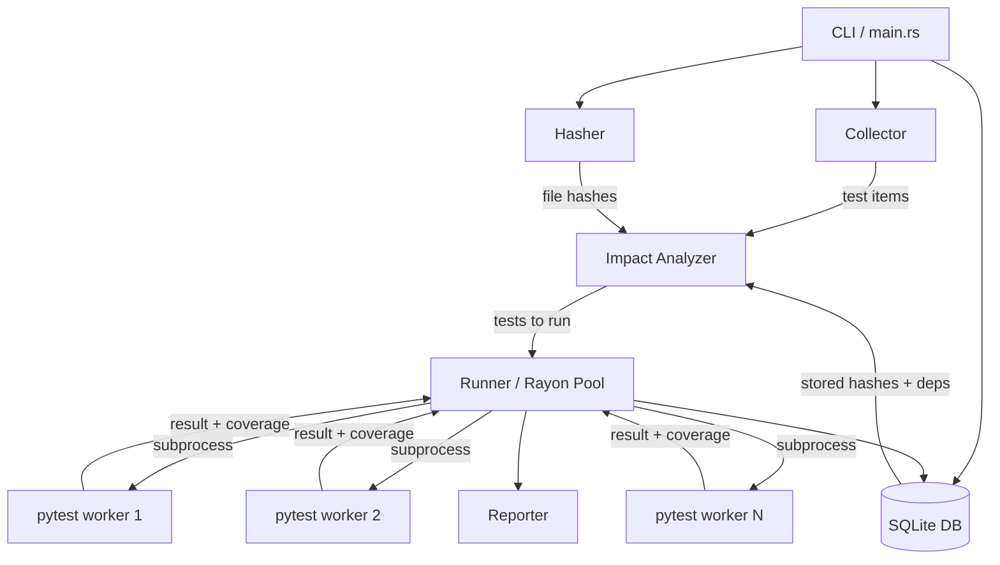

# Architecture

## System Overview

riptide is a single compiled binary written in Rust. It orchestrates Python test execution without being a Python process itself — giving it native-speed control over parallelism, file I/O, and state management.



## Key Design Decisions

### Why subprocesses, not embedding Python?

riptide runs each test as a `pytest` subprocess rather than embedding CPython via PyO3. This was a deliberate choice:

- **Isolation**: Each test gets a clean Python process. No shared state, no import cache pollution.
- **Compatibility**: Full `conftest.py`, fixture, and plugin support — no reimplementation needed.
- **Stability**: PyO3 embedding is complex and version-sensitive. Subprocess is robust.
- **Cost**: Subprocess startup is ~250ms per test. This is acceptable given the parallelism and impact-analysis savings.

### Why SQLite for state?

- Zero infrastructure — no daemon, no server, no network
- Single file, trivially backed up or cleared
- ACID guarantees — concurrent writes from parallel workers are safe
- Fast enough for thousands of test records

### Why SHA-256 for change detection?

Git status would be faster but requires git. SHA-256 of file contents works in any environment — Docker containers, CI runners without git, monorepos with unusual structures.

## Module Breakdown

| Module | Responsibility | Key Types |
|---|---|---|
| `main.rs` | CLI parsing, top-level orchestration | `Cli`, `Commands` |
| `collector.rs` | Regex-based test discovery | `TestItem` |
| `hasher.rs` | SHA-256 file fingerprinting | `hash_file()`, `find_changed_files()` |
| `db.rs` | SQLite persistence layer | `Database` |
| `impact.rs` | Changed file → affected test mapping | `ImpactAnalyzer` |
| `runner.rs` | Rayon parallel execution, coverage extraction | `Runner`, `TestResult` |
| `reporter.rs` | Terminal output, coverage report | `print_summary()` |

## Data Flow: Normal Run

```
1. Parse CLI args
2. Open / create .riptide.db
3. Collect all test items (regex scan)
4. Hash all .py files in tree
5. Query DB for stored hashes → find changed files
6. For each test: check if own file changed OR any dep changed OR last result=failed
7. Partition: to_run | skipped
8. Rayon: spawn N workers, each runs: python -m pytest <nodeid>
9. (if --coverage): python -m coverage run ... per test
10. Parse stdout for pass/fail status
11. Extract covered file list from coverage JSON
12. Write: test results, dep graphs, new file hashes → DB
13. (if --coverage): coverage combine → merged report
14. Print summary + coverage table
```

## Concurrency Model

riptide uses [Rayon](https://github.com/rayon-rs/rayon) for data parallelism:

```rust
tests.par_iter().for_each(|test| {
    let result = runner.run_single(test);
    // results collected into Arc<Mutex<Vec<TestResult>>>
});
```

Each test runs in a separate OS thread → subprocess. The thread pool size defaults to `available_parallelism()` (CPU count). Per-test coverage data is written to unique `.coverage.<test_id>` files to avoid write conflicts.

## Limitations (v0.1)

- **Linux only** — container namespaces not used yet, but `std::process::Command` is portable; macOS support is straightforward in a future release
- **No fixture awareness** — riptide cannot statically detect fixture dependencies; the dep graph is built from runtime coverage data only
- **No parametrize expansion** — parametrized tests are collected as single items; pytest handles the expansion at runtime
